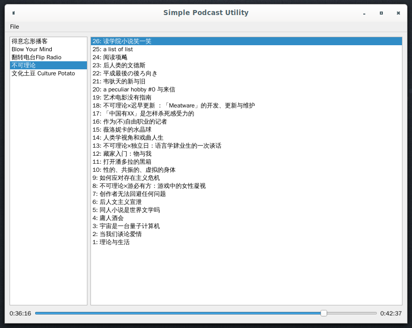

# Simple Podcast Utility

simple tools for search, download or play podcast

## dependency

`request`,`json`,`PySide2` 

## install 

1. install Python from [https://www.python.org/downloads/](https://www.python.org/downloads/)
2. `pip install requests json PySide2`

## usage

`python gui.py`

## screen shot

